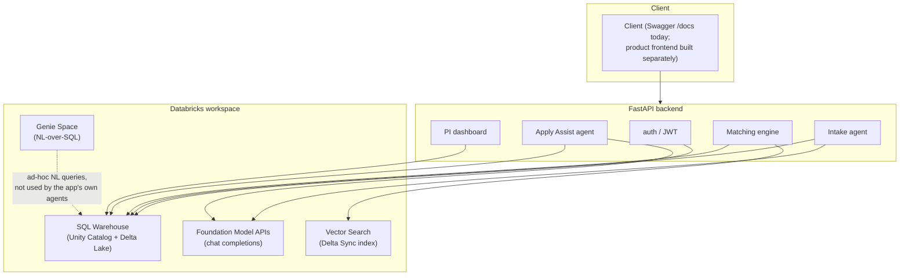
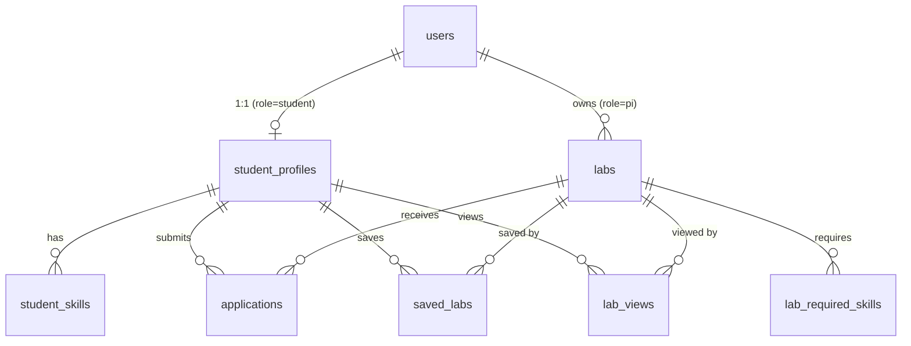

# Architecture

Insenio's backend, database, and AI layers run entirely on Databricks — a hard constraint for the hackathon this was built for. This document describes what was actually built, not just what was planned; see `Genie_Campus_Lab_Match_Design_Doc.md` and `DatabricksPRDTRD.pdf` for the original product spec.

## System overview

## Why two different "AI" mechanisms

Databricks Genie Spaces (aka "Genie Agents") are text-to-SQL engines over Unity Catalog tables — they answer natural-language questions by generating and running SQL, and cannot hold a free-form conversation, extract structured JSON, or draft grounded prose with guardrails. Early design assumed Genie could power the conversational intake agent; it can't. The system instead uses:

- **Genie Space** — exposed as a standalone NL-query capability over `labs` / `lab_required_skills`, for ad-hoc questions like "which labs need PyTorch and have open slots?" It is not in the request path of any other feature.
- **Foundation Model APIs** (`databricks-meta-llama-3-3-70b-instruct`, chat completions via `WorkspaceClient.serving_endpoints`) — the actual conversational layer. Powers both the intake agent and Apply Assist. This is the only LLM surface the app's own agents call.

## Data model

Unity Catalog `insenio.campus_lab_match`, normalized (junction tables instead of array columns, so matching is plain SQL joins and skill-array parameter binding issues with the SQL connector are avoided):

`labs.reliability_score` is a mutable field (starts at 1.0, decays on unanswered applications — see below), not a static rating.

## Conversational intake

`POST /genie/intake/chat` — two LLM responsibilities per turn, both against the Foundation Model endpoint:

1. **Reply** — a natural conversational follow-up (e.g. narrowing a vague "I like AI" into model-building vs. data/language vs. systems).
2. **Extract** — pull whatever's confidently stated into the structured profile schema (`academic_year`, `major`, `availability_hrs`, `interest_tags`, `skills` with proficiency), merged into the student's existing profile so it updates live across turns rather than requiring one final submission.

**Guardrail design**: a classifier call (`is_in_scope`, temperature 0, JSON-only response) runs *before* the reply-generating call. If the latest message is off-topic or attempts to change the assistant's role/instructions, the reply model is never invoked — a fixed redirect message is returned instead. This two-step classify-then-reply pattern was adopted after manual testing showed a prompt-only instruction (single call, "stay on topic" in the system prompt) could be bypassed by a direct injection attempt; splitting classification out as its own strict-scope call closed that gap. Verified by an automated eval suite (`backend/evals/scope_cases.py`) covering off-topic Q&A, prompt injection, and jailbreak phrasing, balanced against on-topic control cases to also catch over-refusal.

## Matching engine

`app/matching/engine.py` — deliberately transparent: every match result carries a plain-language `reasons` list, and the label logic never collapses down to a bare score.

Three components computed per (student, lab) pair:

1. **Skill overlap** — depth-aware (beginner/intermediate/advanced ranked), computed against `lab_required_skills` vs. `student_skills`.
2. **Availability overlap** — student's stated weekly hours vs. the lab's `time_commitment_hrs`.
3. **Interest alignment** — word-level keyword overlap always runs (gives quotable words for the reasons list); when available, Vector Search embedding similarity between the student's stated interests and the lab's `research_focus` text *replaces* the keyword score as the actual signal, since it catches phrasing overlap keyword matching can't (e.g. "model building" vs. "foundation models" share no literal words). `interest_alignment_method` in every match response tells the caller which signal actually drove the score.

Labeling:
- **`Ready now`** — skill overlap ≥ 0.7, availability fits, capacity open.
- **`Stretch pick`** — capacity open, meaningful interest alignment, *and* a named skill gap (skill overlap alone, without real interest signal, stays unlabeled rather than diluting the label into "any partial match").
- No label, but still shown with reasons (e.g. "No open slots right now") — a lab isn't hidden just because it isn't currently a good match; the reason why is part of the transparency contract.

## Semantic search (Vector Search)

A Delta Sync index (`labs_research_focus_index`) embeds `labs.research_focus` via `databricks-gte-large-en`. Delta Sync requires Change Data Feed on the source table (enabled in `init_vector_search.py`) and runs with `pipeline_type=TRIGGERED` — it does not continuously watch for changes, so the app explicitly calls `sync_index()` after any lab create/update (`app/matching/semantic.py:trigger_index_sync`). A resync takes roughly 1-2 minutes; until it completes, `query_similar_labs` naturally falls back to `{}` and the matching engine uses keyword overlap instead — a brand-new lab is immediately visible and SQL-matchable in the marketplace, but its *semantic* interest score briefly lags behind until the async reindex finishes. `query_similar_labs` is written to never raise (any Vector Search error, timeout, or unready index returns `{}`), so a slow or momentarily-unavailable index degrades matching quality, not availability.

## Apply Assist

`POST /labs/{lab_id}/apply-assist` drafts an outreach message and answers to a lab's application questions via a single grounded LLM call. The system prompt's strict grounding rule ("only reference facts given to you... never invent projects, experience, coursework, or skills the student doesn't have") is the only defense against fabrication — there is no separate verification pass on the output. This is covered by an eval suite (`backend/evals/apply_assist_cases.py`) that probes with labs requiring skills/certifications absent from the test profile and checks the draft doesn't affirmatively claim them, plus a positive control confirming real matched skills do get mentioned (so the eval can't be trivially satisfied by a model that just refuses to write anything specific).

Apply Assist only ever produces a draft. The student must separately call `POST /applications` with an explicit message to actually create an application record — the agent has no path to submit anything on its own.

## PI dashboard and reliability decay

`GET /labs/{lab_id}/applicants` returns each applicant alongside their matched/missing skills (recomputed live via the matching engine, not stored). `GET /labs/{lab_id}/stats` returns view counts, unique viewers, a live count of students currently scoring `Ready now`/`Stretch pick` against that lab, and the lab's `reliability_score`.

`reliability_score` starts at 1.0 per lab and decays by 0.15 (floor 0.3) each time a student marks an application as having received no response (`POST /applications/{id}/no-response`) — a lightweight, visible incentive for PIs to engage with applicants, surfaced directly in the marketplace and match reasons rather than buried in an internal metric.

## Auth

JWT (`python-jose`), bcrypt password hashing via `passlib`. Login failures on an unrecognized/malformed hash (e.g. a bad seed value) are caught explicitly and treated as a failed login rather than allowed to raise — an unhandled `UnknownHashError` from passlib previously crashed `/auth/login` with a 500 for any account with a non-bcrypt hash.

## Performance notes

- **Connection reuse** (`app/db/client.py`) — one Databricks SQL connection is held per worker thread (`threading.local()`) rather than opened fresh on every query. Each new connection costs 1-3s+ of handshake overhead against the SQL warehouse; reusing connections was the single biggest latency fix in this codebase (a stats endpoint went from 150s+ timeouts to sub-5s).
- **Bulk fetching over N+1** — anywhere a computation needs data for many students or many labs (e.g. `count_strong_matches_for_lab`, `list_labs`'s required-skills attachment), the code does one or two bulk queries with an `IN (...)` clause and joins in Python, rather than looping a per-row query.
- **Aggregate stats skip the live semantic call** — `count_strong_matches_for_lab` scores with `use_semantic=False`; a keyword-only approximation is an acceptable tradeoff for a dashboard count that doesn't need to call Vector Search once per student.

Typical latency at demo scale (18 labs, single warehouse, warm connection): `/health` ~0.6s, `/labs` ~1.7s (three sequential warehouse round-trips), `/matches` ~3.3s (includes one live Vector Search + Foundation Model-adjacent round trip). The SQL warehouse round-trip itself, not application logic, is the dominant cost at this scale.

## Known limitations

- Seeded demo labs have `pi_user_id = NULL` — they're demo content, not owned by a real PI account, so the PI-dashboard side can only be exercised against labs created through the API by a real PI signup.
- The Apply Assist grounding eval is a heuristic sentence-level scan (affirmative-claim + negation-cue matching), not a judge-model verification — documented in `evals/apply_assist_cases.py` as a lightweight, repeatable signal rather than a certified grounding proof.
- Vector Search resync is fire-and-forget and asynchronous; there's no webhook/callback when it completes, so semantic scoring for a just-created or just-updated lab briefly (1-2 min) reflects the previous embedding state.
